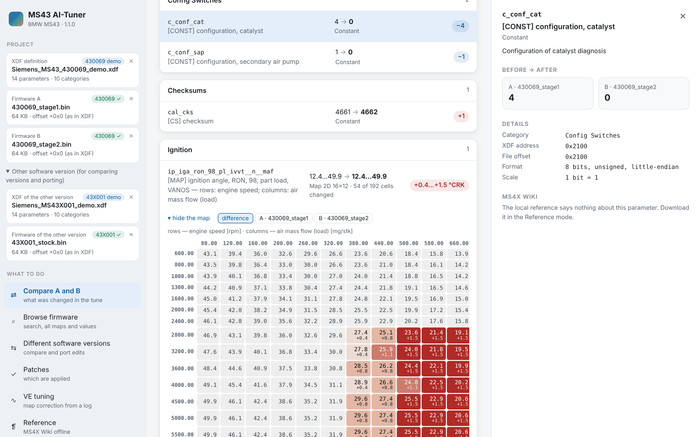
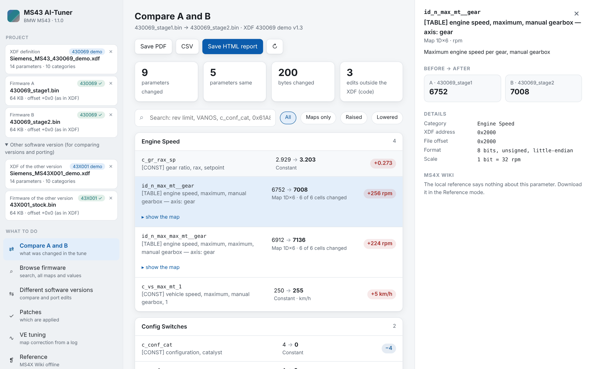
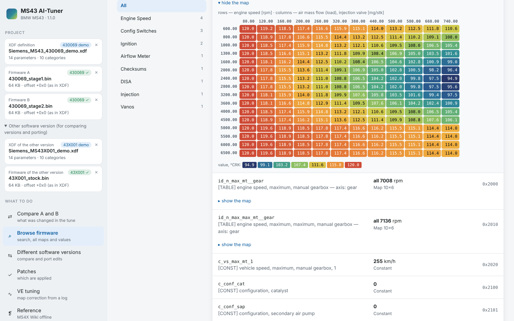
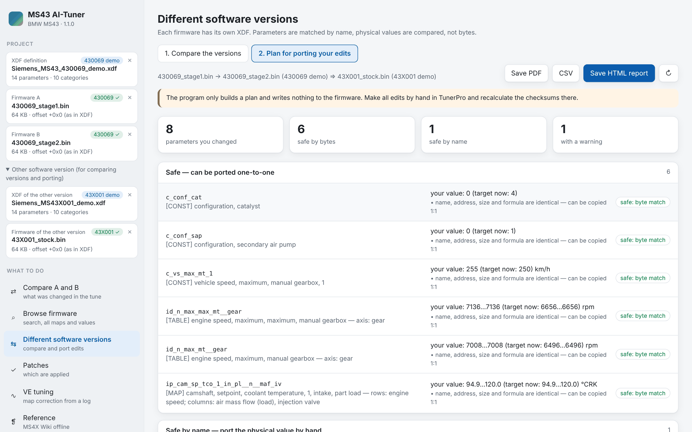
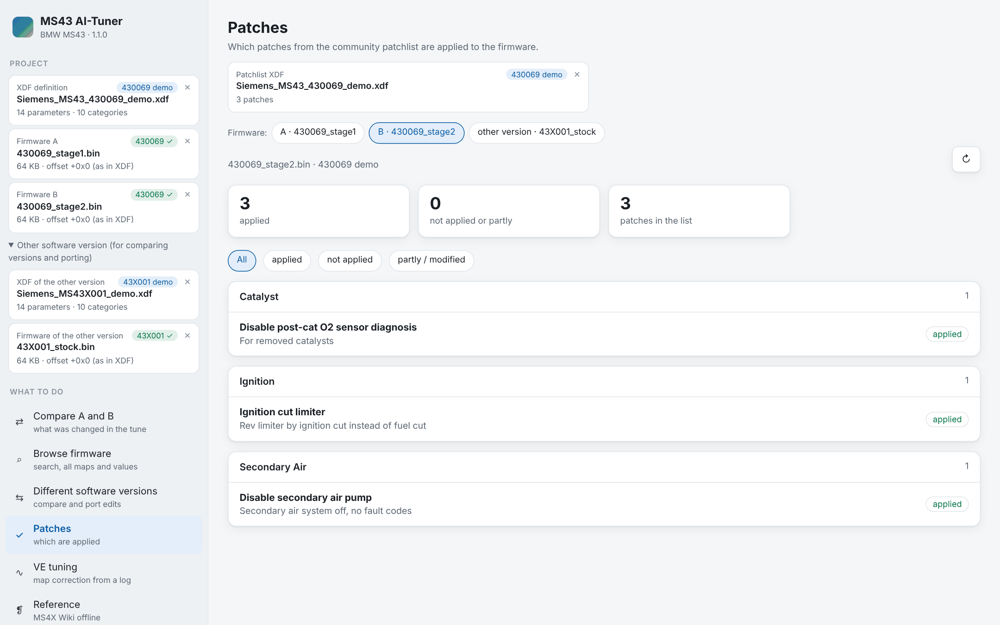
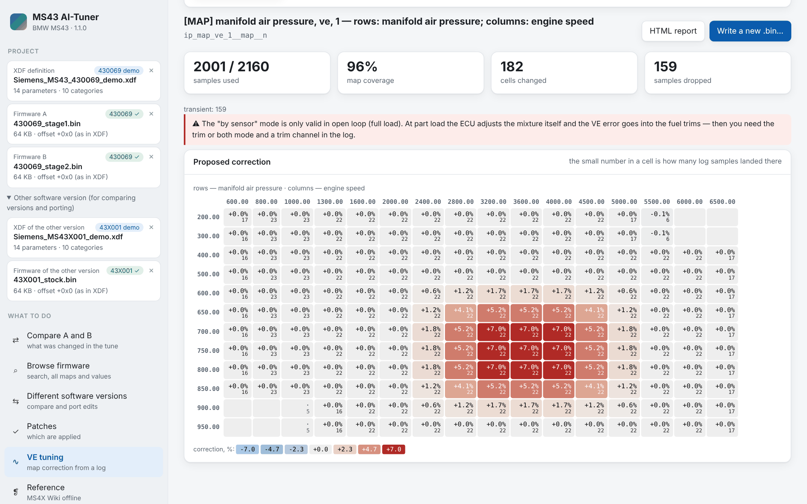
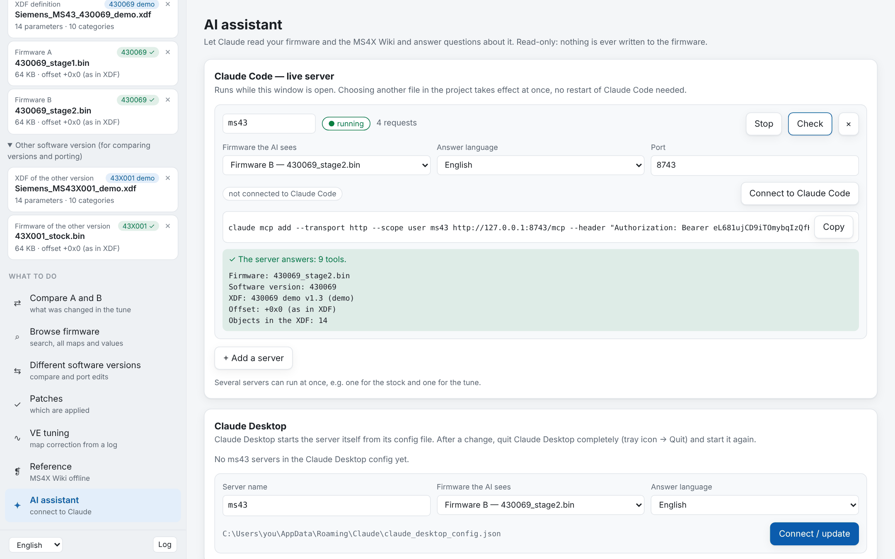

<div align="center">

# MS43 AI-Tuner

### Understand your BMW MS43 tune — not just stare at hex.

Compare firmware in plain language, see every map as a heat‑map, read the MS4X Wiki offline,
and let **Claude** answer questions about *your* actual file.




</div>

> **Public edition.** Nothing derived from the MS4X Wiki is bundled here (no copy of the wiki, no glossary, no translations). The reference still works: the **Reference** tab → **Update from site** downloads it straight from ms4x.net. The core tool is unchanged.

---

## Why

You have a stage 1 and a stage 2 file for your M54. TunerPro shows you 3,700 objects with names
like `ip_iga_ron_98_pl_ivvt__n__maf` and a hex editor shows you 200 changed bytes. Neither tells
you **what the tuner actually did** — or whether it's safe.

MS43 AI-Tuner does:

| | |
|---|---|
| 🔍 **What changed, in words** | *"Rev limiter +256 rpm · ignition +1.5° above 2800 rpm · catalyst monitoring off · secondary air pump disabled"* — grouped, filtered, explained. |
| 🌡️ **Every map as a heat‑map** | Red where it was raised, blue where it was lowered. You see the *shape* of a tune in a second. |
| 📖 **The wiki next to every parameter** | The MS4X Wiki, offline. Click `c_conf_cat` and see what `4` and `0` mean and what to do after changing it. |
| 🤖 **Ask Claude about your file** | *"Is my rev limit higher than stock?"* — the AI reads the real values from your firmware, not from memory. |
| 🛡️ **Read‑only by design** | Your `.bin` is never touched. Edits stay in TunerPro, where you can see them. |

It is an **analyst, not an editor**: built for people who tune MS43 by hand and want to know
exactly what is in a file — their own, a downloaded one, or the one the shop flashed.

---

## Quick start

1. Download **`ms43-ai-tuner-windows.zip`** from [Releases](../../releases), unpack it anywhere.
2. Run **`ms43-ai-tuner.exe`** — no install, no Python.
3. On the left, pick your **XDF** and two **.bin** files. Press **Compare**.

That's it. Everything you pick is remembered for next time. Bring your own `.xdf` / `.bin` — none
are included.

---

## A tour

### Compare two files



Every changed parameter, **old → new in real units** (rpm, °CRK, km/h), grouped by system. Filter
to maps only, raised or lowered values, or search in plain English. Click any row and the side
panel tells you what it is, what its values mean, how it is usually tuned, what to do after
changing it — and the warnings from the wiki. Files are labelled by name (`A · 430069_stage1`,
`B · 430069_stage2`), so comparing two tunes is as clear as stock vs. tune. Save it as an
**HTML, CSV or PDF** report.

### Browse a firmware



Open one file and look around: search by name or meaning (*rev limit*, *knock*, *VANOS*), jump
through categories, open any map with its real axes.

### Port your edits to another software version



Tuned a 430069 and moving to a different build? Give it your stock, your tune and the new
target. It works out **your** edits and sorts them: *safe to copy*, *safe by name — move the
value by hand*, or *careful — size, scale or axes differ* (with look‑alike names suggested).
Values are moved as **physical units**, not bytes, because the same parameter often has a
different scale in another version. It only makes the plan; it never writes.

### Check patches



Load the community Patchlist XDF and see at once which patches a file has — applied, not
applied, or only partly there.

### Dial in fuelling from a wideband log



Drop in a wideband O2 log. It finds how far the mixture was from target in every cell of the
fuel map and proposes a correction as a % heat‑map. It **checks the run first** — coverage,
samples per cell, transient rows — and leaves cells with too little data alone. You get an HTML
report and, after you confirm, a **new** `.bin` copy (recalculate checksums in TunerPro).

### The MS4X Wiki, offline

The whole tuning reference inside the program, searchable, with an **All warnings** list —
every "don't do this" in one place. Because the wiki names parameters in its text, every other
screen (and the AI) shows exactly what the wiki says about the parameter in front of you.

---

## ⭐ Ask Claude about your firmware



The program includes an **MCP server** — a bridge that lets an AI assistant read your firmware
and the reference on demand. Then you just talk:

> *"Show me the ignition map and compare part load with full load."*
> *"What does `c_conf_cat = 4` mean, and what breaks if I set it to 0?"*
> *"I'm removing the cats — what do I change, and what should I watch out for?"*
> *"Is my rev limit higher than stock? By how much in each gear?"*

The answers come from **your file**. The AI doesn't hold the whole firmware in its head — it
asks for exactly the values it needs, so it doesn't lose track in long conversations. The
server is **read‑only**: it can look, never write.

**Claude Code** — open the **AI assistant** screen, choose which file the AI sees and the answer
language, press **Start**, then **Connect to Claude Code** (or copy the one‑line command).
It runs while the window is open; switch the file in the project and the AI sees the new one at
once. Several servers can run side by side, e.g. one per tune.

**Claude Desktop** — same screen, **Claude Desktop** block → **Connect / update**. The program
edits Claude's config for you (the Microsoft Store version too), keeps your other servers and
makes a `.bak` first. Or drag your `.xdf` and `.bin` onto `mcp-add.bat`.

<details>
<summary>What the AI can ask for</summary>

| Tool | What it returns |
|---|---|
| `firmware_info` | software version, XDF match, size |
| `list_categories` / `list_params` | what's in the file, by category or pattern |
| `get_param` | one parameter: value in real units, decoded name, description |
| `read_map` | a whole map with its axes |
| `explain_value` | what a specific value means |
| `search_wiki` / `wiki_page` | the reference |
| `cautions` | safety warnings tied to a parameter |

</details>

<details>
<summary>Manual setup (without the window)</summary>

Claude Code:
```
claude mcp add ms43 -- "C:\ms43-ai-tuner\ms43-ai-tuner-mcp.exe" -x "C:\path\def.xdf" -b "C:\path\firmware.bin" --lang en
```

Claude Desktop (`claude_desktop_config.json`):
```json
{
  "mcpServers": {
    "ms43": {
      "command": "C:\\ms43-ai-tuner\\ms43-ai-tuner-mcp.exe",
      "args": ["-x", "C:\\path\\def.xdf", "-b", "C:\\path\\firmware.bin", "--lang", "en"]
    }
  }
}
```
</details>

---

## Safety first

Changing engine calibrations affects reliability and emissions, and in many countries it is
not legal on public roads. This tool is built to make you *more* careful, not less:

* 🔒 Your original `.bin` is **never modified**. The only thing that writes a firmware file is VE
  tuning — always a new copy, always after you confirm.
* 🧮 Checksums are **never recalculated** — do that in TunerPro (`cal_cks`, `cal_mon_cks`) before
  flashing, or the ECU will go into limp mode.
* ⚠️ If a firmware's software version doesn't match the XDF, you are warned: wrong addresses
  mean garbage results.
* 🤖 An AI is an assistant, not a guarantee. Check ignition, fuel and limiter changes against
  the reference and your logs.

**Use at your own risk.**

---

## For the curious

<details>
<summary>Command line</summary>

Everything the window does is also available from the command line (`python -m ms43diff`):

| Command | What it does |
|---|---|
| `diff A.bin B.bin -x def.xdf` | compare two files; `--html/--csv/--json/--md/--pdf` |
| `show -x def.xdf -b fw.bin NAME [-c other.bin]` | one map or constant with its axes |
| `find -x def.xdf "rev limit"` | search in English or Russian |
| `list`, `dump -o values.csv` | list parameters / export the whole file to CSV |
| `xdiff A.bin B.bin -A a.xdf -B b.xdf` | compare different software versions |
| `port stock.bin tune.bin target.bin -A a.xdf -B b.xdf` | porting plan |
| `patches -x patchlist.xdf -b fw.bin` | which patches are applied |
| `vetune log.csv -x def.xdf -b fw.bin -m MAP` | VE correction; `--write new.bin` |
| `multi`, `info`, `wiki`, `mcp`, `gui` | several files at once, file info, reference, AI server, window |

Put `--lang en` or `--lang ru` before the command to choose the language.
</details>

<details>
<summary>How it works</summary>

* **Addressing.** A 512 KB XDF declares `BASEOFFSET 0x70000` (calibration is the last 64 KB); the
  offset is detected automatically, so 512 KB and 64 KB files both work. Sanity check on a stock
  E39 M54B30: `c_gr_rax_sp` @ `0x706A2` = `EE 02` → 750 × 0.003906 = **2.93**, the 530i final drive.
* **Values** come from the XDF `<MATH>` formulas, parsed by a small safe evaluator (never `eval`
  on file data). Axis tables are resolved, so maps show real rpm and mg/stroke.
* **Names** are decoded from the Siemens abbreviation scheme — `ip_iga_ron_98_pl_ivvt__n__maf` =
  map · ignition · RON98 · part load · VANOS · rows rpm · columns airflow — plus hand‑written
  explanations for the parameters people actually tune.
* **Porting** matches names exactly, then after normalisation (`ron_98` ↔ `ron98`); anything
  less certain is only suggested, never applied.
* **The window** is a small local web server shown in an Edge app window (its own profile, no
  tabs). `--classic` starts the older tkinter window.
</details>

<details>
<summary>Build from source, self‑test, CI</summary>

```bash
python gui_main.py                     # the window
python -m ms43diff --help              # the command line
python selftest.py                     # no firmware needed
python -m pip install pyinstaller reportlab
python build_exe.py                    # dist/: both .exe, the .bat helpers, the zip
```

The core needs only the Python standard library; `reportlab` is optional, for PDF. The self‑test
builds synthetic XDF/BIN/log/wiki files and runs every command, report, the AI server and every
screen of the window, in English and Russian. GitHub Actions builds the Windows `.exe` on every
`v*` tag and attaches it to the release.

The screenshots above come from a demo project (`docs/screens/`), not from real firmware, and
were taken without the wiki loaded.
</details>

---

## Credits

The tuning reference comes from the [MS4X Wiki](https://www.ms4x.net) — copyright belongs to its
authors. Huge thanks to the MS4x community; if the site helps you, the authors ask for a small
donation (see their main page).
