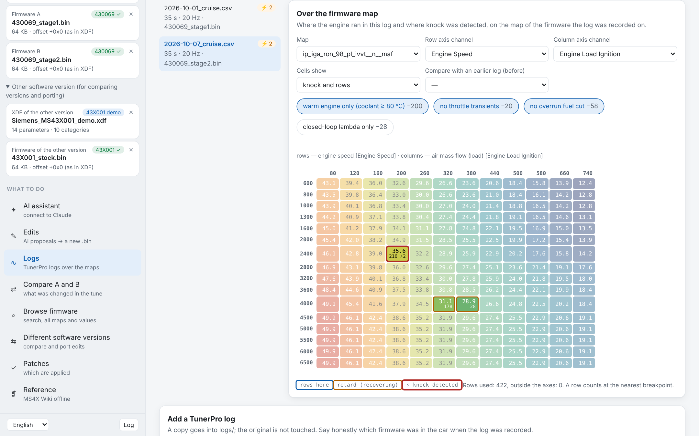
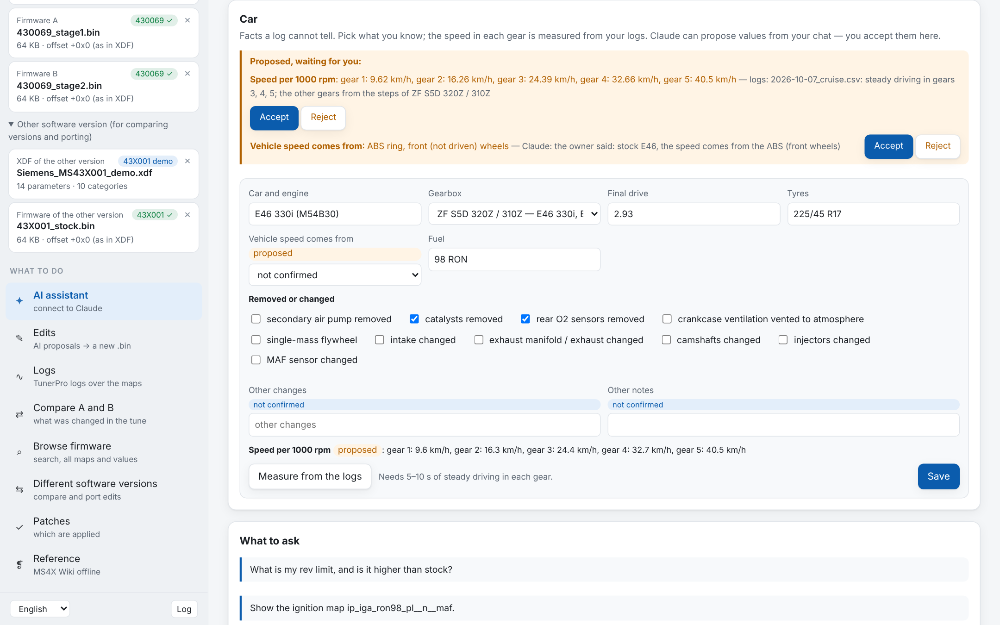
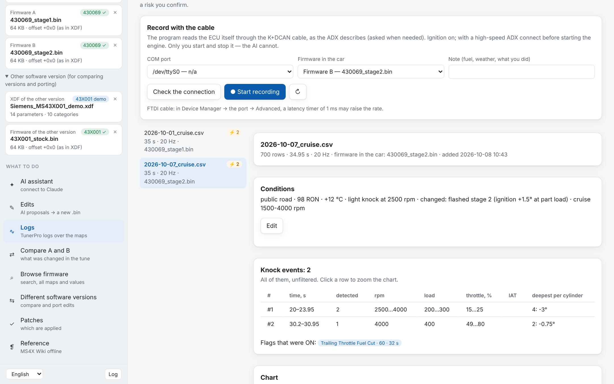
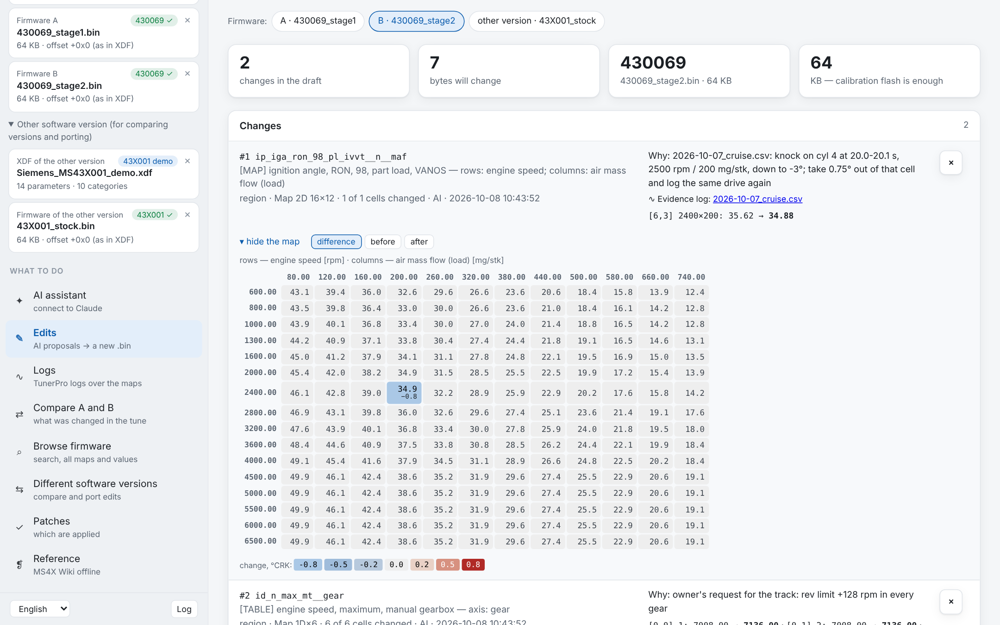

<div align="center">

# MS43 AI-Tuner

### A careful AI tuner for the BMW Siemens MS43 (M52TU / M54).
### It reads your firmware and your logs, finds what is wrong and proposes fixes. You decide, and you make the new `.bin`.




</div>

> **Public edition.** Nothing derived from the MS4X Wiki is bundled here (no copy of the wiki, no glossary, no translations). The reference still works: the **Reference** tab → **Update from site** downloads it straight from ms4x.net. The core tool is unchanged.

---

## Why

Tuning an MS43 means hours in TunerPro: scrolling logs, guessing which map cell the engine sat in
when it knocked, comparing two `.bin` files byte by byte, re-reading the MS4X Wiki to remember
what `c_conf_cat = 4` does. MS43 AI-Tuner hands that grind to **Claude Code**, and keeps you in
charge:

* **Claude reads everything.** The firmware through your XDF, every row of every log, the MS4X
  Wiki. Then it tells you what it sees, with times and cells.
* **Claude never writes firmware.** It has no tool for that. It can only put a *proposal* into a
  draft, with the log evidence behind it.
* **You see every change** as a heat map and byte by byte, and you press the button that writes
  `name_vN.bin`. MS4x Flasher flashes it and fixes the checksums.

---

## The loop

```
 ┌──────── plan ─────────┐   ┌──────── record ────────┐   ┌──────────── analyse ─────────────┐
 │ Claude asks WHERE you  │ → │ built-in K+DCAN logger │ → │ the log is bound to its firmware; │
 │ will log; writes a plan│   │ or TunerPro (.xdl/.csv)│   │ Claude reads rows, modes, maps    │
 └────────────────────────┘   └────────────────────────┘   └─────────────────┬─────────────────┘
 ┌───── flash ──────┐   ┌─────────── new file ───────────┐   ┌────────── changes ──────────┐
 │ MS4x Flasher,     │ ← │ Edits: heat maps, bytes, risks │ ← │ Claude drafts them, citing   │
 │ fixes checksums   │   │ → name_vN.bin + .changes.txt   │   │ the log (cells, times)       │
 └─────────┬─────────┘   └────────────────────────────────┘   └──────────────────────────────┘
           └──→ a new log in the same conditions → before / after on the same map
```

---

## Quick start

1. Download **`ms43-ai-tuner-windows.zip`** ([Releases](../../releases) or a build artifact) and
   unpack it: `ms43-ai-tuner.exe` plus `python\` (Python with pandas and charts for log analysis,
   nothing to install).
2. Run **`ms43-ai-tuner.exe`**. On the left pick the **XDF** and your firmware (A and/or B).
3. **AI assistant** screen → **Start** the live server.
4. Same screen, **Project for Claude Code**: pick a folder → **Create the project** →
   **Open in Claude Code** (the Code tab of the Claude desktop app; `>_` opens a terminal).
5. Tell Claude: *"I want to record logs, help me prepare."*

The MCP server lives in the window. If Claude Code starts while the window is closed, nothing
breaks: the tools answer *"the window is closed"*, and work as soon as you open it. No reconnect
needed.

---

## What's inside

### 🧠 A tuning project for Claude Code


One button creates a folder Claude Code works in. It contains rules, skills, tools and the
connection to the window:

| In the project | What it is |
|---|---|
| `CLAUDE.md` | **your** file: notes about the car. It imports the rules, and the program never overwrites it |
| `.claude/ms43-rules.md` | the rules: changes only through the draft, evidence first, small steps, never hide an event, people's safety first |
| `.claude/skills/` | `logging-setup`, `wot-pull`, `log-review`, `ignition`, `fuel-trims`, `change-request` |
| `.claude/settings.json` | protects the generated files from edits, UTF-8 for Python, a start-of-session check |
| `analysis/STATE.md` | the current state of the car, kept short by Claude after each review |
| `logs/` · `analysis/` | your logs · Claude's scripts, charts and reviews |

Your own skills and notes are never touched when the project is updated. A session hook tells
Claude at start whether the window is open, whether generated files were edited by hand, and
whether log files are lying around unadded.

### 🚗 The car, without typing ratios



Analysis needs facts a log cannot tell: the gearbox, the final drive, the tyres, where the speed
signal comes from, what was removed. You **pick** them, and nobody types ratios to three decimals:

* **Lists.** Gearboxes are picked from a catalogue: ZF S5D 320Z, Getrag 220/5 · S5D 250G,
  Getrag 240/5, Getrag 260/5, Getrag 265 dogleg, Getrag 220 4-speed, GS6-37BZ, and the automatics.
  Typical final drives, the tyre size, the speed sensor and removed parts are picked the same way.
* **Measured from your logs.** A short calibration drive (5–10 s steady in each gear) gives the
  real speed per 1000 rpm in every gear. The gearbox is recognised by the *steps* between gears,
  so a wrong speedometer doesn't fool it. The program also tells you how far the logged speed is
  off (`c_vs_fac`, tyres or final drive) and whether the ECU's own gear recognition agrees.
* **Claude proposes, you accept.** If you mention "single-mass flywheel from an M30" in the chat,
  Claude files it as a proposal and you press **Accept**. Every value is *confirmed*, *proposed*
  (with its source) or *unknown*. Claude never fills an unknown with a typical value.

### 📈 Logs



* **Built-in logger.** It reads the ECU through a K+DCAN (FTDI) cable exactly as your ADX
  describes, and sends nothing else. Check the connection, start, stop. Rpm, coolant and oil are
  shown live, the link reconnects by itself, and every byte is kept in a raw journal.
* **Or TunerPro as usual.** Its native **`.xdl`** is decoded with your ADX. The decoder was
  verified against TunerPro's own export on 131 channels × 7193 rows, and the raw file is kept
  so a log can be decoded again. A CSV export works too.
* **Bound to its firmware.** Every log remembers which `.bin` was in the car. An edit of another
  firmware that cites the log is flagged as a risk.
* **Conditions.** Where it was recorded, fuel, air temperature, what bothers you, *what changed
  since the last log*. They can be edited at any time. Claude asks before judging a log without
  them.
* **Knock, all of it.** Every event, unfiltered, with time, rpm, load, throttle, IAT and depth
  per cylinder. *Detected* knock is told apart from the slow *retard* recovery afterwards.
* **Over the map.** Where the engine ran and where it knocked, on any map with axes. You can
  filter for a warm engine, steady throttle, no overrun or closed loop only, and show the mean of
  any channel per cell (fuel trims!).
* **Before / after.** Two logs on the same map: knock gone, new, still there.
* **Honest data.** Empty channels, stuck channels, slow channels (the speed may update once a
  second) and physically impossible spikes are all reported. Fuel trims pinned at the limits read
  from *your* firmware are listed with their time ranges.

### ✏️ Edits



Everything Claude proposed: before → after in real units, a difference heat map, the reason, the
**evidence log** (a click opens it on that map), the byte diff. Every edit is checked before
writing:

* the software version matches;
* the offset is the one the XDF declares;
* the value survives rounding;
* a patch goes only over its original bytes.

**Risky** changes need a typed confirmation word: more advance, higher limits, knock control, full
load, protections off, or an edit of a firmware other than the logged one.

**Create .bin** writes `name_vN.bin` (the source stays untouched) plus `name_vN.changes.txt` with
the reasons and both sha256 sums. It reads the file back to check it, and tells you whether a
64 KB calibration flash is enough.

### 🔍 Compare, browse, port, patches


* **Compare A and B**: every changed parameter in words and real units, grouped by system, with
  the reference's warnings. Export to HTML / CSV / PDF.
* **Browse**: search by name or meaning; any map with its real axes.
* **Different software versions**: compare and plan porting your edits to another build (by
  physical values, not bytes).
* **Patches**: which Community Patchlist patches are applied.

### 📚 MS4X Wiki, offline

The reference is searched, linked to XDF parameters and keeps its tables (sensor scales,
pinouts). It shows whether it is complete ("pages N of M"). An update runs in the background with
a progress bar and finds **new MS43 pages** on the site. Redirects and blocked or empty answers
never wipe a good copy. Warnings mean real risks only (damage, bricking, a non-starting engine,
"not advised"), not every "note".

---

## What Claude can ask for: 24 MCP tools

<details>
<summary>The list</summary>

| Area | Tools |
|---|---|
| Firmware | `firmware_info`, `list_categories`, `list_params`, `get_param`, `read_map`, `firmware_diff` (what a tune changed vs another file or the stock) |
| Reference | `search_wiki`, `wiki_page`, `explain_value`, `cautions` (English originals) |
| Draft | `edit_propose`, `edit_list`, `edit_remove`, `edit_show` (the draft only, never a file) |
| Logs | `log_list`, `log_info` (conditions, quality, every knock event, fuel trims at limits, implausible values), `log_modes` (idle segments, full-throttle pulls with gear and rpm rate, the limiter, time-weighted knock), `log_rows`, `log_map_hits`, `log_compare`, `log_show` |
| Car | `car_info`, `car_calibrate` (gears from steady driving), `car_propose` (a value for you to accept) |

</details>

---

## Safety first

* 🔒 Your source `.bin` is **never modified**. A new file comes only from the window, on your
  button press, as `name_vN.bin`, with a change log and a read-back check.
* 🧮 Checksums are fixed by **MS4x Flasher** when flashing. Before the first flash, make a full
  512 KB backup (Read → Full).
* 🚗 Before any logging Claude asks **where**. On a public road it plans part load within the
  traffic rules only. Full-throttle pulls are planned only for a closed section, a track or a
  dyno, with a passenger at the laptop. It plans before and analyses after, and never coaches the
  driver in real time.
* 📈 A change rests on a log of the same firmware.
* 🤖 Claude is an assistant, not a guarantee. Narrowband sensors cannot show the full-load
  mixture; that needs a wideband.

Changing calibrations affects engine life and emissions and is illegal on public roads in many
countries. **Use at your own risk.**

---

## Under the hood

<details>
<summary>How it is built</summary>

* **The window** is a local web server in an Edge window. The MCP server (HTTP + token,
  127.0.0.1 only) runs in the same process and sees the drafts, the logs and the project. Claude
  Code reaches it through a tiny stdio bridge started by Claude Code itself, so a closed window
  never leaves a "failed" server behind.
* **Addressing**: the XDF offset is detected for 64 and 512 KB files. Edits are written only with
  the offset the XDF declares.
* **Formulas** (`<MATH>`) go through a small safe parser (with `& | << >>`), never `eval`.
* **ADX / XDL**: packets, bit fields, lookups, output types and macros are read from your ADX. The
  K-line echo, the DS2 checksum and the baud switch are handled by the logger.
</details>

<details>
<summary>Command line</summary>

`python -m ms43diff`: `diff`, `show`, `find`, `list`, `dump`, `xdiff`, `port`, `patches`,
`info`, `multi`, `wiki` (`--download`, `--import FILE`), `gui`. `--lang en|ru` goes before the
command.
</details>

<details>
<summary>Build, self-test, CI</summary>

```bash
python gui_main.py                 # the window
python selftest.py                 # self-test, no files needed
python build_exe.py --with-python  # .exe + Python for Claude (build on Windows)
```

GitHub Actions builds the Windows `.exe`, runs it with `--check` and verifies that the project kit,
the serial port library and Python are inside. The screenshots come from a demo project
(`docs/screens/`), not from real firmware.
</details>

---

## Credits

The reference comes from the [MS4X Wiki](https://www.ms4x.net); all rights belong to its authors.
Huge thanks to the MS4x community. If the site helps you, the authors ask for a small donation
(see their main page). Gearbox ratios in the catalogue are typical values from enthusiast sources,
and the calibration checks them against your own logs.
